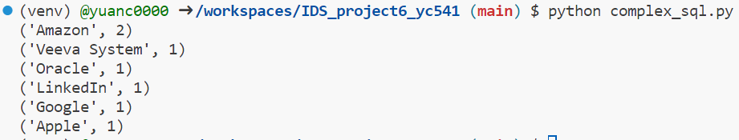

# IDS706-Week6-ComplexSQL-SQLite

This repository is part of the Week 6 mini-project for IDS706. It illustrates the implementation of complex SQL queries involving joins, aggregation, and sorting using Python and SQLite.

In this assignment, a Python script is used to interact with an SQLite database. It covers the creation of tables, insertion of data, as well as performing complex SQL operations that showcase joins, aggregation, and sorting.

### 1 How to Run

1. Make sure Python is installed.
2. Execute the script using `python complex_sql.py`.
3. For saving outputs, use `python complex_sql.py > output_log.txt`.
4. Check the results.

### 2 Script Breakdown

1. **Connection Establishment**:
    A connection is made to an SQLite database, named `jobsDB.db`. If absent, it's generated.
    
2. **CRUD Operations**:
    Detailed functions for creating, reading, updating, and deleting data in both `jobs` and `job_applicants` tables.

3. **Complex SQL Query**:
    An intricate query combines both tables, highlighting aggregation, joins, and sorting.

### 3 Complex Query Explanation

The `complexQuery` function inside the `main.py` file undertakes an SQL query to aggregate and count the number of job listings provided by each company. Here's a closer look at the SQL query:

```sql
SELECT company_name, COUNT(job_id) as job_count
FROM jobs
GROUP BY company_name
ORDER BY job_count DESC
```

**Breakdown**:
- **SELECT company_name, COUNT(job_id) as job_count**: This segment selects the company_name and calculates the total job_id count for each company. This aggregated count is labeled as job_count.
- **FROM jobs**: The data is pulled from the jobs table.
- **GROUP BY company_name**: Results are grouped based on the company_name, so each company appears once in the outcome with an aggregated job listings count.
- **ORDER BY job_count DESC**: Sorting is applied based on the job_count in a descending order. Thus, companies with the maximum job listings are at the top.

**Interpretation of Results**:
Upon execution, the result will illustrate a list of companies followed by the number of job roles they have advertised. The list is sorted with companies having the highest job postings appearing first.

**Sample output**:
```
('Amazon', 2)
('LinkedIn', 1)
('Google', 1)
('Apple', 1)
('Oracle', 1)
('Veeva System', 1)
```
This output implies Amazon has advertised 2 roles, while the remaining companies have each posted 1 job role.


